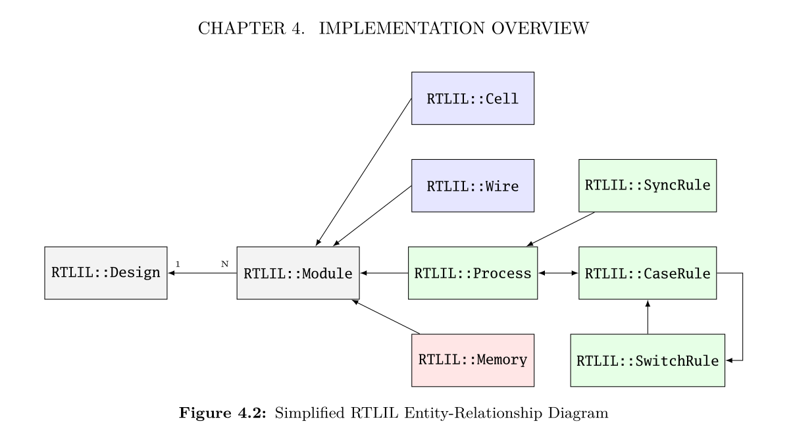
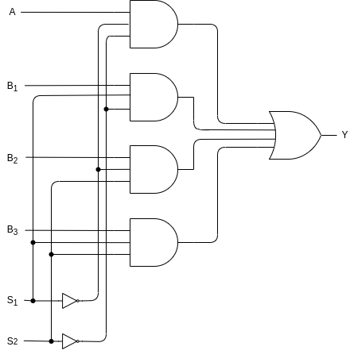
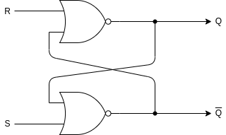
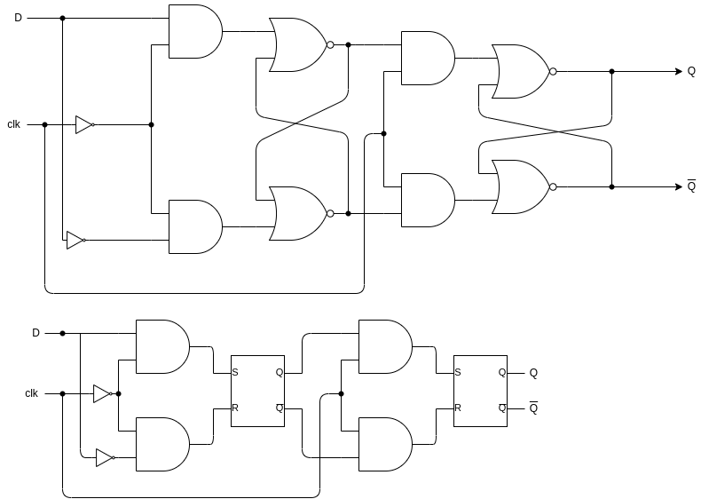
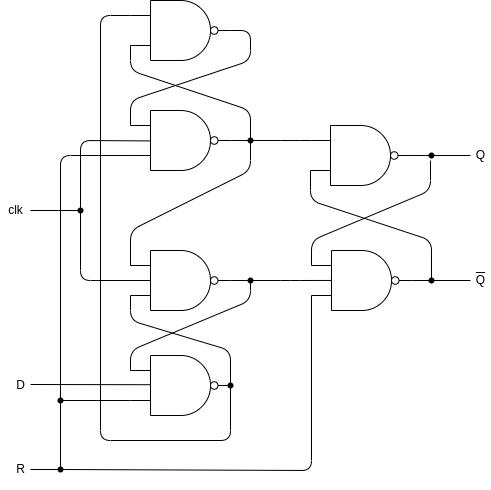

[TOC]

# Debug

## main

Located in `yosys/kernel/driver.cc:197`

# rtlil objects (c++)

Basic organization of rtlil objects:

## RTLIL::IdString

The identifier of a RTLIL object.

## RTLIL::Design

The container for `RTLIL::Module` (zero to many).

It also keeps a list of selected objects (modules) in order passes can operate on determined modules.

There always be a `RTLIL::Design *current_design;` pointing to the design that is being processed.

## RTLIL::Module

Contain objects as follow:

1. Module name (`RTLIL::IdString`)
2. Zero to many `RTLIL::Cell`,  `RTLIL::Wire`, `RTLIL::Process` and `RTLIL::Memory`
3. A list of attributes
4. A list of connections between wires
5. An optional frontend callback used to derive parametrized variations of the module

## RTLIL::Wire

An RTLIL::Wire object has the following properties:
1. The wire name
2. A list of attributes
3. A width (buses are just wires with a width > 1)
4. Bus direction ([MSB to LSB](https://en.wikipedia.org/wiki/Bit_numbering) or vice versa)
5. Lowest valid bit index (LSB or MSB depending on bus direction)
6. If the wire is a port: port number and direction (input/output/inout)

## RTLIL::Cell

An RTLIL::Cell object has the following properties:
1. The cell name and type
2. A list of attributes
3. A list of parameters (for parametric cells)
4. Cell ports and the connections of ports to wires and constants
   The connections of ports to wires are coded by assigning an `RTLIL::SigSpec` to each cell port

## RTLIL::SigSpec

A “signal” is everything that can be applied to a cell port (wire, constant, memory or concatenation/selection of them).

## RTLIL::Process

An RTLIL::Process is a container for:
1. zero or more `RTLIL::SyncRule`
2. exactly one `RTLIL::CaseRule`

Note that `RTLIL::CaseRule` is a container for:
1. Zero or more assignments (`RTLIL::SigSig`) 
2. Zero or more `RTLIL::SwitchRule` objects. 

And `RTLIL::SwitchRule` objects is a container for zero or more `RTLIL::CaseRule` objects, which makes case rule and switch rule recursively contain each other.

## RTLIL::Memory

A memory object has the following properties:
1. The memory name
2. A list of attributes
3. The width of an addressable word
4. The size of the memory in number of words

Several cells are used to manipulate `RTLIL::Memory`:
1. All read accesses to the memory are transformed to $memrd cells
2. all write accesses to the memory are transformed to $memwr cells
3. Memory initialization is transformed to $meminit cells

# Internal cells

## multiplexer

### $mux

#### Gate wire

#### ports & Truth Table

yosys provide the following ports for $mux cell:
1. Input port: `\A=A`, `\B=B`
2. Signal port: `\S=sel`, this is a simple bit port
3. Output port: `\Y=Y`

The corresponding truth table for 1 bit are:

| A   | B   | sel | Y   |
| --- | --- | --- | --- |
| 1   | 0   | 0   | 1   |
| 1   | 1   | 0   | 1   |
| 0   | 0   | 0   | 0   |
| 0   | 1   | 0   | 0   |
| 1   | 0   | 1   | 0   |
| 1   | 1   | 1   | 1   |
| 0   | 0   | 1   | 0   |
| 0   | 1   | 1   | 1   |

Or a more readable form:

| sel | Y   |
| --- | --- |
| 0   | A   |
| 1   | B   |

#### parameters

1. `\WIDTH`: The width of inputs `\A` and `\B` and output `\Y` ports

### $pmux

#### Gate wire

The following is an example of 2 bit selection with one bit input and output wire graph.

There may be different and more complex designs with increasing bits

#### ports & Truth Table

yosys provide the following ports for $pmux cell:
1. Input port: `\A=A` with width of `\WIDTH`, `\B=B` with width of `\WIDTH` multiply `\S_WIDTH`
2. Signal port: `\S=sel` with width of `\S_WIDTH`
3. Output port: `\Y=Y` with width of `\WIDTH`

With the width expansion in signal port it provide the ability to select n'th piece of input data:
1. when `sel=0` the output will be `A` 
2. when `sel>0` separate `B` into `\S_WIDTH` parts with each part have a width of `\WIDTH` 
   then set output to be `sel`'th part of `B` 

The following is a truth table for 2 bit selection with one bit input and output wire graph:

| sel | Y       |
| --- | ------- |
| 00  | A       |
| 01  | B1 |
| 10  | B2 |
| 11  | B3 |

#### parameters

1. `\WIDTH`: The width of inputs `\A` and output `\Y` ports
2. `\S_WIDTH`: The width of selection signal `\S`
3. The width of `\B=B` is the multiplication of `\WIDTH` and `\S_WIDTH`

## register
### $sr

#### Gate wire

#### ports & Truth Table

yosys provide the following ports for $sr type latch:
1. Input ports: `\SET=S` and `\CLR=R` 
2. Output ports: `\Q=Q`

The corresponding truth table for 1 bit are:

| S   | R   | Q   | Q |
| --- | --- | --- | ----------------------------------------------- |
| 1   | 0   | 1   | 0                                               |
| 0   | 1   | 0   | 1                                               |
| 0   | 0   | Q   | Q |
| 1   | 1   | X   | X                                               |

Note:
1. `\SET` and `\CLR` have separate bits for every output bit 
2. If `\SET=1` and `\CLR=1` then `Q=0`

#### parameters

1. `\WIDTH`: The width of inputs `\SET` and `\CLR` and output `\Q` ports
2. `\SET_POLARITY`: The set input bits are active-high if this parameter has the value `1’b1` and active-low if this parameter is `1’b0`
3. `\CLR_POLARITY`: The reset input bits are active-high if this parameter has the value `1’b1` and active-low if this parameter is `1’b0`

### $dff

#### Gate wire

The following graph are equivalent, while the RS latch is replaced by a black box in the second graph.

#### ports & Truth Table

yosys provide the following ports for $dff cell:
1. Clock port: `\CLK=clk`
2. Input port: `\D=D`
3. Output port: `\Q=Q`

The corresponding truth table for 1 bit are:

| D   | clk    | Q   | Q |
| --- | ------ | --- | ----------------------------------------------- |
| 1   | &uarr; | 1   | 0                                               |
| 0   | &uarr; | 0   | 1                                               |
| X   | 0      | Q   | Q |
| X   | 1      | Q   | Q |

#### parameters

1. `\WIDTH`: The width of inputs `\D` and output `\Q` ports
2. `\CLK_POLARITY`: Clock is active on the positive edge if this parameter has the value 1’b1 and on the negative edge if this parameter is 1’b0

### $adff

#### Gate wire

#### ports & Truth Table

yosys provide the following ports for $adff cell:
1. Clock port: `\CLK=clk`
2. Input port: `\D=D`
3. Reset port: `\ARST=R`, this is a single bit port
4. Output port: `\Q=Q`

The corresponding truth table for 1 bit are:

| R   | D   | clk    | Q   | Q |
| --- | --- | ------ | --- | ----------------------------------------------- |
| 0   | X   | X      | 0   | 1                                               |
| 1   | 0   | &uarr; | 0   | 1                                               |
| 1   | 1   | &uarr; | 1   | 0                                               |
| 1   | X   | 0      | Q   | Q |
| 1   | X   | 1      | Q   | Q |

#### parameters

1. `\WIDTH`: The width of inputs `\D` and output `\Q` ports
2. `\CLK_POLARITY`: Clock is active on the positive edge if this parameter has the value 1’b1 and on the negative edge if this parameter is 1’b0
3. `\ARST_POLARITY`: The asynchronous reset is active-high if this parameter has the value 1’b1 and active-low if this parameter is 1’b0
4. `\ARST_VALUE`: The state of \Q will be set to this value when the reset is active
