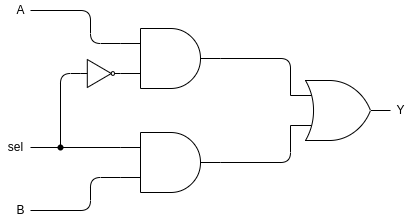

[TOC]

# Debug

## main

Located in `yosys/kernel/driver.cc:197`

## dump

The `RTLIL::IdString`'s content can be viewed by `RTLIL::IdString::str()` method.

The normal print function cannot be called during debug, thus for printing:
1. Add `#include "backends/rtlil/rtlil_backend.h"` in the start of the file
2. Using dump function where needed, e,g: `RTLIL_BACKEND::dump_proc(std::cout, " ", pr);`

## rtlil generation

Starting function [`derive`](yosys/frontends/ast/ast.cc#L1645), which is called by `hierarchy` pass;

Then it calls [`process_module`](yosys/frontends/ast/ast.cc#L995) to process each module and add to current design.

The module level rtlil are mainly generated by [`genRTLIL`](yosys/frontends/ast/genrtlil.cc#L1191) function.

# proc pass

## proc_arst


## proc_dff

In this pass, there is no [`RTLIL::CaseRule`](#rtlilcaserule) or [`RTLIL::SwitchRule`](#rtlilswitchrule) in process, only lefted with [`RTLIL::SyncRule`](#rtlilsyncrule)

The main function is `void proc_dff(RTLIL::Module *mod, RTLIL::Process *proc, ConstEval &ce)` processing the following steps:
1. Find one of the target signal written by always, save in `RTLIL::SigSpec sig`
2. Find the following: 
   | local variable                 | value meaning                                                                                                                                                                     |
   | ------------------------------ | --------------------------------------------------------------------------------------------------------------------------------------------------------------------------------- |
   | `RTLIL::SyncRule *sync_level`  | 1. Save level `RTLIL::SyncRule`<br>2. if there are many of them, save in `many_async_rules`<br>3. In this pass, level sync rule only resulted from asynchronous CLR or SET signal |
   | `RTLIL::SigSpec rstval`        | 1. Save the value give to `sig` of level `RTLIL::SyncRule`<br>2. if there are many of them, save in `many_async_rules`                                                            |
   | `RTLIL::SyncRule *sync_edge`   | 1. Save edge `RTLIL::SyncRule`<br>2. Only one edge rule, otherwise error                                                                                                          |
   | `RTLIL::SyncRule *sync_always` | 1. Save always `RTLIL::SyncRule`<br>2. Has to be the only sync rule, otherwise error                                                                                              |
   | `RTLIL::SigSpec insig`         | 1. Sync type is edge, always or global clock, it is the signal giving value to `sig`<br>2. Only one `insig`, otherwise error                                                      |
3. If many level `RTLIL::SyncRule` found:
   1. If multiple `RTLIL::SyncRule` will sync the same `rstval`, creating `$ne`, using it as CLR or SET of dff, thus any edge of the sync signal will cause edge of `$ne` and trigger dff. After that, clear `many_async_rules`
   2. Otherwise, insert `rstval` and `sync_level` into `many_async_rules` and clear them
4. If `rstval == sig` then `sig` is valuing itself when CLR or SET, create `$mux` select on sensitive signal of `sync_level` and output `sig` or `insig`, plus an `$dff` will do the job.
5. If `sync_always != NULL` then test if `sync_level == NULL` and `sync_edge == NULL`. If yes, then create connect cell, otherwise error
6. If `many_async_rules.size() > 0`, call [`gen_dffsr_complex`](#gen_dffsr_complex)
7. Else if `rstval` is a signal (variable) that cannot be evaluated, generate `$aldff` with `AD` as `rstval`
8. Else If `sync_edge` empty, generate `$ff`, 
9. else if `sync_level` empty, generate `$dff`
10. Else generate `$adff`

### gen_dffsr_complex

This function generates the multiple if else statements logic with a `$dffsr` register.

#### Step 1

Looping over `many_async_rules`, for each `value` making the following cells:


In the graph:
1. `low_i` is `level-low` sync signals (which is negative edge signals); `high_i` is `level-high` sync signals (which is positive edge signals)
2. If any of `low_i == 0` or `high_i == 1`, then right `$reduce_or` will output `1` and both `$mux` activated, output `value` and negation of `value`
3. Else both `$mux` deactivated, output `clr_in` and `set`
4. If the first loop, then `clr_in = 0` and `set_in = 0`	

After the loop, we have a bunch of cells that:
1. If one of the `value`s sensitive signal all deactivated, it will pass the previous result as output
2. If non of the `value`s sensitive signals is activated, then the first `clr_in` and `set_in` will be the output, which is both 0
3. If one of the `value`s has a sensitive signal activated:
   1. The output of that part `clr_in = ~value` and `set_in = value`
   2. It passes the meaning of clear the `i`'th bits that `value[i] == 0` and set the `i`'th bits that `value[i] == 1`
   3. It will overwrite the previous `clr_in` and `set_in`
4. The final output of this step defined as `clr_out` and `set_out`

#### Step 2

Creating a `$affsr` with:
1. `clk`: edge triggered clock signal
2. `d`: signal output when non of the `value`s' sensitive signal is activated
3. `set`: the `clr_out` of last step
4. `clr`: the `set_out` of last step

# rtlil objects (c++)

Basic organization of rtlil objects:


## RTLIL::IdString

The identifier of a RTLIL object.

To display what is inside, using `RTLIL::IdString::str()` method of the object.

## RTLIL::Design

The container for `RTLIL::Module` (zero to many).

It also keeps a list of selected objects (modules) in order passes can operate on determined modules.

There always be a `RTLIL::Design *current_design;` pointing to the design that is being processed.

## RTLIL::Module

Contain objects as follow:

1. Module name (`RTLIL::IdString`)
2. Zero to many `RTLIL::Cell`,  `RTLIL::Wire`, `RTLIL::Process` and `RTLIL::Memory`
3. A list of attributes
4. A list of connections between wires
5. An optional frontend callback used to derive parametrized variations of the module

## RTLIL::Wire

An RTLIL::Wire object has the following properties:
1. The wire name
2. A list of attributes
3. A width (buses are just wires with a width > 1)
4. Bus direction ([MSB to LSB](https://en.wikipedia.org/wiki/Bit_numbering) or vice versa)
5. Lowest valid bit index (LSB or MSB depending on bus direction)
6. If the wire is a port: port number and direction (input/output/inout)

## RTLIL::Cell

An RTLIL::Cell object has the following properties:
1. The cell name and type
2. A list of attributes
3. A list of parameters (for parametric cells)
4. Cell ports and the connections of ports to wires and constants
   The connections of ports to wires are coded by assigning an `RTLIL::SigSpec` to each cell port

## RTLIL::SigSpec

A “signal” is everything that can be applied to a cell port (wire, constant, memory or concatenation/selection of them).

```c++
struct RTLIL::SigSpec
{
private:
	int width_;
	unsigned long hash_;
	std::vector<RTLIL::SigChunk> chunks_; // LSB at index 0
	std::vector<RTLIL::SigBit> bits_; // LSB at index 0
	...
	inline int size() const { return width_; }
	inline bool empty() const { return width_ == 0; }
	...
	void pack() const;
	void unpack() const;
	...
}
```

While:
1. `width_`: width of signal, it equals to the sum of width of `chunks_` or `bits_.size()`
2. `std::vector<RTLIL::SigChunk> chunks_`: selecting "width" of signal start at "offset", or "width" of wired constant
3. `std::vector<RTLIL::SigBit> bits_`: selecting 1 bit of signal start at "offset", or 1 bit of wired constant
4. `void pack()`: move all signals from `bits_` to `chunks_`
5. `void unpack()`: move all signals from `chunks_` to `bits_`

## RTLIL::Process

An RTLIL::Process is a container for:
1. zero or more `RTLIL::SyncRule`
2. exactly one `RTLIL::CaseRule`

Note that `RTLIL::CaseRule` is a container for:
1. Zero or more assignments (`RTLIL::SigSig`) 
2. Zero or more `RTLIL::SwitchRule` objects. 

And `RTLIL::SwitchRule` objects is a container for zero or more `RTLIL::CaseRule` objects, which makes case rule and switch rule recursively contain each other.

## RTLIL::CaseRule

Main structure as follow:
```c++
struct RTLIL::CaseRule : public RTLIL::AttrObject
{
	std::vector<RTLIL::SigSpec> compare;
	std::vector<RTLIL::SigSig> actions;
	std::vector<RTLIL::SwitchRule*> switches;
	...
};
```

While:
1. `std::vector<RTLIL::SigSpec> compare`: list of compare values
2. `std::vector<RTLIL::SigSig> actions`: list of actions (assign) need to do if any of compare values satisfy
   `typedef std::pair<SigSpec, SigSpec> SigSig;`: translate as assign `action.first` to `action.second`
3. `std::vector<RTLIL::SwitchRule*> switches`: switches contained in this `CaseRule`

note:

In the following grammar, `compare` will have multiple conditions, thus put a list here.

```sv
case (A)
	2'd0, 2'd2: Q = 1;
	2'd1, 2'd3: Q = 0;
endcase
```

## RTLIL::SwitchRule

Main structure as follow:

```c++
struct RTLIL::SwitchRule : public RTLIL::AttrObject
{
	RTLIL::SigSpec signal;
	std::vector<RTLIL::CaseRule*> cases;
	...
};
```

While:
1. `RTLIL::SigSpec signal`: the signal to be switched on
2. `std::vector<RTLIL::CaseRule*> cases`: the list of case rules

## RTLIL:SyncRule

Class as follow:

```c++
struct RTLIL::SyncRule
{
	RTLIL::SyncType type;
	RTLIL::SigSpec signal;
	std::vector<RTLIL::SigSig> actions;
	std::vector<RTLIL::MemWriteAction> mem_write_actions;

	template<typename T> void rewrite_sigspecs(T &functor);
	template<typename T> void rewrite_sigspecs2(T &functor);
	RTLIL::SyncRule *clone() const;
};
```

While:
1. `RTLIL::SyncType type`: indicating type of sync (posedge,negedge or level)
2. `RTLIL::SigSpec signal`: signals that is sensitive on
3. `std::vector<RTLIL::SigSig> actions`: list of assigns if sync rule activated

## RTLIL::Memory

A memory object has the following properties:
1. The memory name
2. A list of attributes
3. The width of an addressable word
4. The size of the memory in number of words

Several cells are used to manipulate `RTLIL::Memory`:
1. All read accesses to the memory are transformed to $memrd cells
2. all write accesses to the memory are transformed to $memwr cells
3. Memory initialization is transformed to $meminit cells

# Internal cells

## multiplexer

### $mux

#### Gate wire



#### ports & Truth Table

yosys provide the following ports for $mux cell:
1. Input port: `\A=A`, `\B=B`
2. Signal port: `\S=sel`, this is a simple bit port
3. Output port: `\Y=Y`

The corresponding truth table for 1 bit are:

| A   | B   | sel | Y   |
| --- | --- | --- | --- |
| 1   | 0   | 0   | 1   |
| 1   | 1   | 0   | 1   |
| 0   | 0   | 0   | 0   |
| 0   | 1   | 0   | 0   |
| 1   | 0   | 1   | 0   |
| 1   | 1   | 1   | 1   |
| 0   | 0   | 1   | 0   |
| 0   | 1   | 1   | 1   |

Or a more readable form:

| sel | Y   |
| --- | --- |
| 0   | A   |
| 1   | B   |

#### parameters

1. `\WIDTH`: The width of inputs `\A` and `\B` and output `\Y` ports

### $pmux

#### Gate wire

The following is an example of 2 bit selection with one bit input and output wire graph.

There may be different and more complex designs with increasing bits


#### ports & Truth Table

yosys provide the following ports for $pmux cell:
1. Input port: `\A=A` with width of `\WIDTH`, `\B=B` with width of `\WIDTH` multiply `\S_WIDTH`
2. Signal port: `\S=sel` with width of `\S_WIDTH`
3. Output port: `\Y=Y` with width of `\WIDTH`

With the width expansion in signal port it provide the ability to select n'th piece of input data:
1. when `sel=0` the output will be `A` 
2. when `sel>0` separate `B` into `\S_WIDTH` parts with each part have a width of `\WIDTH` 
   then set output to be `sel`'th part of `B` 

The following is a truth table for 2 bit selection with one bit input and output wire graph:

| sel | Y       |
| --- | ------- |
| 00  | A       |
| 01  | B<sub>1 |
| 10  | B<sub>2 |
| 11  | B<sub>3 |

#### parameters

1. `\WIDTH`: The width of inputs `\A` and output `\Y` ports
2. `\S_WIDTH`: The width of selection signal `\S`
3. The width of `\B=B` is the multiplication of `\WIDTH` and `\S_WIDTH`

## register
### $sr

#### Gate wire


#### ports & Truth Table

yosys provide the following ports for $sr type latch:
1. Input ports: `\SET=S` and `\CLR=R` 
2. Output ports: `\Q=Q`

The corresponding truth table for 1 bit are:

| S   | R   | Q   | <span style="text-decoration:overline">Q</span> |
| --- | --- | --- | ----------------------------------------------- |
| 1   | 0   | 1   | 0                                               |
| 0   | 1   | 0   | 1                                               |
| 0   | 0   | Q   | <span style="text-decoration:overline">Q</span> |
| 1   | 1   | X   | X                                               |

Note:
1. `\SET` and `\CLR` have separate bits for every output bit 
2. If `\SET=1` and `\CLR=1` then `Q=0`

#### parameters

1. `\WIDTH`: The width of inputs `\SET` and `\CLR` and output `\Q` ports
2. `\SET_POLARITY`: The set input bits are active-high if this parameter has the value `1’b1` and active-low if this parameter is `1’b0`
3. `\CLR_POLARITY`: The reset input bits are active-high if this parameter has the value `1’b1` and active-low if this parameter is `1’b0`

### $dff

#### Gate wire

The following graph are equivalent, while the RS latch is replaced by a black box in the second graph.


#### ports & Truth Table

yosys provide the following ports for $dff cell:
1. Clock port: `\CLK=clk`
2. Input port: `\D=D`
3. Output port: `\Q=Q`

The corresponding truth table for 1 bit are:

| D   | clk    | Q   | <span style="text-decoration:overline">Q</span> |
| --- | ------ | --- | ----------------------------------------------- |
| 1   | &uarr; | 1   | 0                                               |
| 0   | &uarr; | 0   | 1                                               |
| X   | 0      | Q   | <span style="text-decoration:overline">Q</span> |
| X   | 1      | Q   | <span style="text-decoration:overline">Q</span> |

#### parameters

1. `\WIDTH`: The width of inputs `\D` and output `\Q` ports
2. `\CLK_POLARITY`: Clock is active on the positive edge if this parameter has the value 1’b1 and on the negative edge if this parameter is 1’b0

### $adff

#### Gate wire


#### ports & Truth Table

yosys provide the following ports for $adff cell:
1. Clock port: `\CLK=clk`
2. Input port: `\D=D`
3. Reset port: `\ARST=R`, this is a single bit port
4. Output port: `\Q=Q`

The corresponding truth table for 1 bit are:

| R   | D   | clk    | Q   | <span style="text-decoration:overline">Q</span> |
| --- | --- | ------ | --- | ----------------------------------------------- |
| 0   | X   | X      | 0   | 1                                               |
| 1   | 0   | &uarr; | 0   | 1                                               |
| 1   | 1   | &uarr; | 1   | 0                                               |
| 1   | X   | 0      | Q   | <span style="text-decoration:overline">Q</span> |
| 1   | X   | 1      | Q   | <span style="text-decoration:overline">Q</span> |

#### parameters

1. `\WIDTH`: The width of inputs `\D` and output `\Q` ports
2. `\CLK_POLARITY`: Clock is active on the positive edge if this parameter has the value 1’b1 and on the negative edge if this parameter is 1’b0
3. `\ARST_POLARITY`: The asynchronous reset is active-high if this parameter has the value 1’b1 and active-low if this parameter is 1’b0
4. `\ARST_VALUE`: The state of \Q will be set to this value when the reset is active

### $sdff

#### Gate wire


#### ports & Truth Table

yosys provide the following ports for $adff cell:
1. Clock port: `\CLK=clk`
2. Input port: `\D=D`
3. Reset port: `\SRST=R`, this is a single bit port
4. Output port: `\Q=Q`

The corresponding truth table for 1 bit are:

| R   | D   | clk    | Q   | <span style="text-decoration:overline">Q</span> |
| --- | --- | ------ | --- | ----------------------------------------------- |
| 1   | X   | &uarr; | 0   | 1                                               |
| 0   | 0   | &uarr; | 0   | 1                                               |
| 0   | 1   | &uarr; | 1   | 0                                               |
| X   | X   | 0      | Q   | <span style="text-decoration:overline">Q</span> |
| X   | X   | 1      | Q   | <span style="text-decoration:overline">Q</span> |

#### parameters

1. `\WIDTH`: The width of inputs `\D` and output `\Q` ports
2. `\CLK_POLARITY`: Clock is active on the positive edge if this parameter has the value 1’b1 and on the negative edge if this parameter is 1’b0
3. `\SRST_POLARITY`: The synchronous reset is active-high if this parameter has the value 1’b1 and active-low if this parameter is 1’b0
4. `\SRST_VALUE`: The state of \Q will be set to this value when the reset is active

### $dlatch

#### Gate wire


#### ports & Truth Table

yosys provide the following ports for $adff cell:
1. Enable port: `\EN=EN`
2. Input port: `\D=D`
3. Output port: `\Q=Q`

The corresponding truth table for 1 bit are:

| EN  | D   | Q   | <span style="text-decoration:overline">Q</span> |
| --- | --- | --- | ----------------------------------------------- |
| 1   | 0   | 0   | 1                                               |
| 1   | 1   | 1   | 0                                               |
| 0   | X   | Q   | <span style="text-decoration:overline">Q</span> |

#### parameters

1. `\WIDTH`: The width of inputs `\D` and output `\Q` ports
2. `\EN_POLARITY`:The enable input is active-high if this parameter has the value 1’b1 and active-low if this parameter is 1’b0.